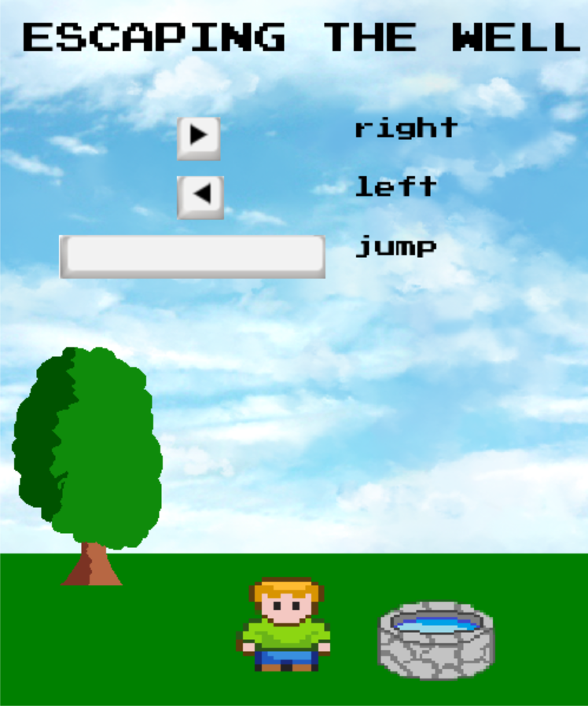
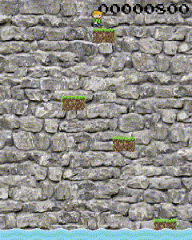

# ESCAPING THE WELL

Idealizadores do jogo:

⋅⋅*Ricardo Mourão Rodrigues Filho
⋅⋅*Rodrigo de Lima Azeredo
⋅⋅*Ykaro de Sousa Andrade

## Introdução

Este projeto consiste na construção de um jogo por meio da biblioteca pygame. Para se divertir com ele, é necessário instalar a biblioteca no prompt de comando do seu editor de texto com o seguinte código: `pip install pygame`. 

Imagine que você caia dentro de um poço e tem que fazer ao máximo para sobreviver? Pois é exatamente nisso que o jogo consiste, em que o personagem tem que fugir de um possível afogamento. Portanto, tente ao máximo pular os obstáculos para que consiga mais pontuações. Será que você vai conseguir?

## Tela de inicio

Assim que for iniciado o jogo no seu editor de texto, você irá se deparar com essa imagem. Ela possui informações de como deve ser realizada a jogabilidade do jogo. Portanto, quando você clicar no botão `ESPAÇO` o personagem irá pular. Quando você clicar no botão direito `->` ou botão esquerdo `<-` o personagem irá para a direita ou para a esquerda, respectivamente. Se clicar em qualquer tecla do seu teclado, o jogo irá começar. Contudo, recomendamos a tecla `ENTER`.

## Iniciando o jogo

No gif acima percebemos como o jogo funciona de uma forma bem intuitiva. Observe que logo no inicio, foi imposto certas dificuldades para você jogador, pois os blocos se movimentam pelo o eixo horizontal de sua tela. Tome cuidado que não é um jogo tão trivial, cuidado para não se afogar. Além disso, observe que a medida que o personagem se mantém vivo no jogo e pula em direção aos blocos ele aumenta sua quantidade de scores e suas pontuações ficam cada vez mais altas.

## Aumentando a velocidade

Você acha que é tão fácil assim escapar do fundo poço? Tudo precisa de um esforço e não vai ser diferente neste jogo. A medida que sua pontuação aumenta, existe uma cobrança maior para sua sobrevivência. Então, foi implementado um aumento de velocidade de acordo com o que seus scores evoluem.

## Game Over

Infelizmente vamos contar um grande spoiler que vai te decepcionar. O jogo funciona através de pontuações, ou seja, assim como na vida, uma hora você irá morrer. Perder no nosso jogo significa encostar na água. Logo, se você não conseguiu suportar a velocidade ou caiu de algum bloco sem conseguir parar em outro, sinto muito, mas irá ocorrer game over como no gif acima. Entretanto, não desanime, pois como no mundo real somos os nossos próprios inimigos. Então, será que você será capaz de bater suas próprias limitações, ou seja, será que você é capaz de ultrapassar seus próprios recordes?

## Código

Para quem quiser ficar por dentro dos bastidores e entender o coração do jogo, vamos fazer uma breve explicação dos códigos que vocês irão encontrar nos arquivos desse Git Hub:

⋅⋅* [assets.py](assets.py): neste segmento, podemos encontrar a criação das funções responsáveis pelas animações do personagem se movimentando e a produção dos blocos. Além disso, foi nesse arquivo a criação de todas as imagens visualizadas durante o jogo.
⋅⋅* [constantes.py](constantes.py): aqui podemos encontrar a definição das constantes que produzem a o tamanho da tela, o tamanho dos blocos, do personagem etc.
⋅⋅* [game_screen.py](game_screen.py): se esse código fosse o corpo humano, esse arquivo seria o lado esquerdo do cérebro do jogo. Nele, é implementado uma função reponsável por gerar um loop que faça o personagem obedecer eventos definidos pelos os criadores e seguir os controles do jogador. Além disso, por ser simples, a tela de game over também foi criada nesse arquivo.
⋅⋅* [init_screen.py](init_screen.py): neste segmento, foi implementado a função que gera a tela de inicio do jogo.
⋅⋅* [logica.py](logica.py): Voltando a analogia do corpo humano, aqui é onde encontramos o coração do nosso jogo. Este arquivo é responsável por executar o nosso jogo, então se quiser jogar, vai ter que passar por ele.
⋅⋅* [sprites.py](sprites.py): Finalmente, aqui foi definida todas as clases do jogo, que são apenas duas. A `Ship` e a `Bloco`, representando o personagem e os blocos, se tornando muito útiil para as movimentações deles. Vamos supor que esse arquivo é lado direito do cérebro do jogo.

## Possíveis Iterações

Por esse jogo existir uma limitação de entrega, não foi possível implementar todas as ideias desejadas. Por isso, quem sabe no futuro os desenvolvedores melhorar ainda mais a jogabilidade dele? Para isso, abaixo foi listado uma lista de possíves iterações:

⋅⋅* Criar blocos aleatórios toda hora em que um some na tela, mas dentro dos parâmetros possíveis de jogabilidade.
⋅⋅* Você pensa que a água está subindo por ilusão de óptica, entretanto, ela sempre esteve parada. Portanto, os criadores desse jogo ainda pensa em usar algum raciocínio que faça a água realmente subir em relação a velocidade do jogo. 
⋅⋅* Implementar fases que façam o jogador subir de nível.

## Sobre os criadores

⋅⋅* Ricardo Mourão Rodrigues Filho: foi responsável por várias implementações no jogo, como por exemplo ajudar no desenvolvimento dos arquivos [sprites.py](sprites.py), entendendo a lógica de diversas classes. Possui o maior número de commits, entretanto, maior parte desse jogo foi feito através de reuniões online em que todos integrantes participaram e desenvolveram juntos.

⋅⋅*Rodrigo de Lima Azeredo: trouxe a ideia principal do jogo, desenvolveu diversos raciocínios para uma melhor jogabilidade do usuário e sempre buscou a implementação de recursos que dificultasse o jogo. Além disso, foi responsável no aumento de velocidade a medida que as pontuações estão evoluindo. Confira no arquivo [game_screen.py](game_screen.py).

⋅⋅*Ykaro de Sousa Andrade: coração da equipe, sempre buscando se reunir para evoluir ainda mais a jogabilidade do jogo. Suas principais atuações estão na implementação de pontuações (consulte [sprites.py](sprites.py)), fazer o bloco se movimentar no eixo horizontal (consulte [game_screen.py](game_screen.py)) etc. Seus commits apresentam nomes diferentes pois houve uma alteração no nome do seu usário do Git Hub, nada que comprometa o desenvolvimento do projeto.

## Referências

⋅⋅* https://github.com/Insper/pygame-snippets.git
⋅⋅* https://opengameart.org/
⋅⋅* https://www.spriters-resource.com/
⋅⋅* https://dessoft.insper-comp.com.br/conteudo/projeto
⋅⋅* https://dessoft.insper-comp.com.br/conteudo/pygame